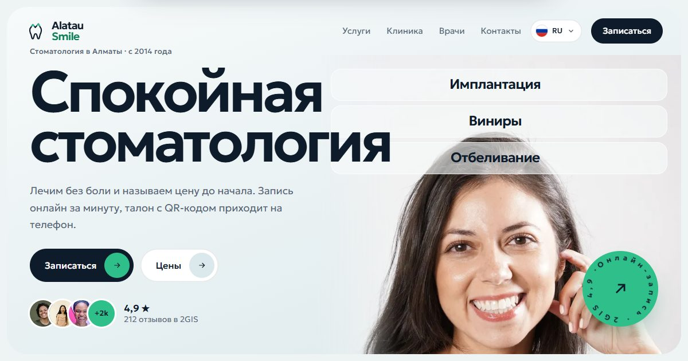

# Alatau Smile: dental clinic site



**Live:** https://alatau-demo.pages.dev

Demo site for a fictional dental clinic in Almaty, Kazakhstan. The whole site sits in a rounded "clinic window" frame. Doctors, prices and reviews are illustrative.

## Features

- Five languages with their own URLs, including Arabic laid out right to left
- Hero with service strips laid over a patient portrait, rotating "Book online" badge, patient avatars
- Editorial price list with a photo preview that follows the pointer
- Doctor carousel with swipe, thumbnails and each doctor's next free slots
- Booking that ends in an appointment card saved to the phone
- Logo (tooth and mountain peaks) that draws itself in the preloader

## Stack

Astro · TypeScript · Tailwind CSS · GSAP · Lenis · Cloudflare Pages

Every page passes an automated layout audit (Puppeteer) at five screen widths and in every language before deploy.

## Run

```bash
npm install
npm run dev
npm run build
```

Made by [Sabir Hussein](https://sabr-studio.pages.dev).
